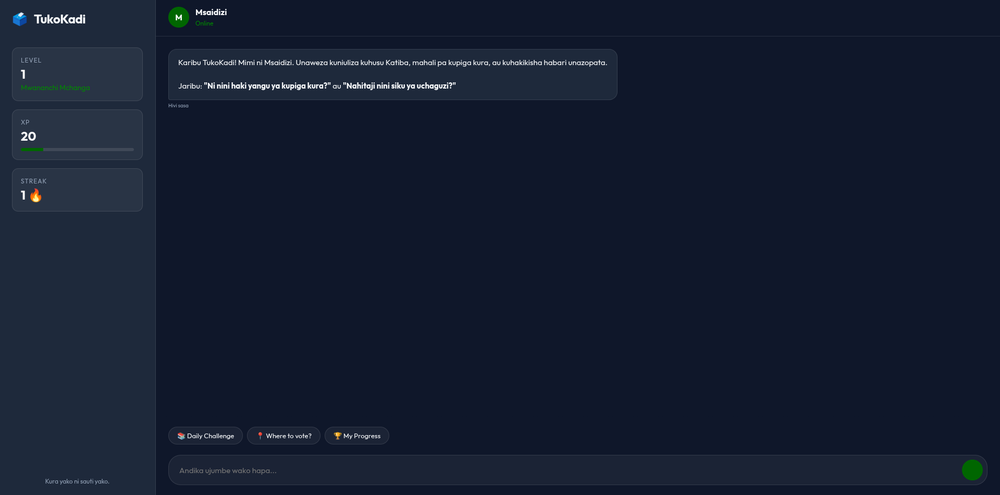

<div align="center">

# 🗳️ TukoKadi — AI-Powered Civic Participation for Every Kenyan Voter

### *"Kura yako ni sauti yako." — Your vote is your voice.*

**Challenge 06: Kenya Special Challenge — TukoKadi Track**

[](https://google.github.io/adk-docs/)
[](https://ai.google.dev/)
[](https://cloud.google.com/vertex-ai-search-and-conversation)
[](https://cloud.google.com/run)

---

*A multi-agent civic participation system that transforms how 22 million+ Kenyan voters access constitutional education, locate polling stations, and combat misinformation — delivered through a gamified, multilingual experience accessible via Web and WhatsApp.*

</div>

---

## 📋 Table of Contents

- [The Problem](#-the-problem)
- [Our Solution](#-our-solution)
- [Agent Architecture](#-agent-architecture)
- [Technology Stack](#-technology-stack)
- [How to Run Locally](#-how-to-run-locally)
- [How to Interact with the Deployed Version](#-how-to-interact-with-the-deployed-version)
- [Data Handling & Political Neutrality Policy](#-data-handling--political-neutrality-policy)
- [Team](#-team)

---

## 🔥 The Problem

Kenya has over **22 million registered voters**. Yet every election cycle, the same barriers persist:

| Barrier | Impact |
|---|---|
| **Civic knowledge gap** | First-time voters (18–24 age group) don't know what's on the ballot, how devolution works, or what their constitutional rights actually protect |
| **Misinformation epidemics** | WhatsApp forwards spread false claims about voting dates, ID requirements, and candidate promises — unchecked and at scale |
| **Election day confusion** | Voters can't find their polling station, don't know what documents to bring, or don't know how to report irregularities |
| **Language exclusion** | Official civic education is overwhelmingly in English; millions of voters are more comfortable in Kiswahili or Sheng |
| **Engagement fatigue** | Traditional civic education is one-directional, bureaucratic, and boring — people tune out |

**The result?** Low civic participation, high vulnerability to manipulation, and a democracy that doesn't fully represent its people.

---

## 💡 Our Solution

**TukoKadi** is an AI-powered civic participation companion that meets voters where they are — on their phones, in their language, and on their terms.

Instead of a single monolithic chatbot, we built a **team of specialized AI agents**, each an expert in one domain, coordinated by an intelligent orchestrator that understands what the voter needs and connects them to the right expert instantly.

### What makes TukoKadi different?

| Feature | How It Works |
|---|---|
| 🎮 **Gamified Learning** | Earn XP, level up from "Mwananchi Mchanga" to "Simba wa Katiba", unlock badges, complete daily challenges — civic education becomes addictive |
| 🌍 **Trilingual** | Auto-detects and responds in English, Kiswahili, or Sheng — no selection menus, just natural conversation |
| 📚 **Citation-backed** | Every answer cites a specific Constitutional Article, IEBC regulation, or Elections Act section. Zero hallucination. |
| 🛡️ **Politically neutral** | Hardcoded guardrails prevent the system from ever endorsing a candidate, party, or political position |
| 🔍 **Fact-checking** | Forward a suspicious WhatsApp message and get an instant VERIFIED / FALSE / UNVERIFIED verdict with source |
| 📍 **Polling station locator** | Find your exact voting center using just your County and Ward |

---

## 🧠 Agent Architecture

TukoKadi uses a **hub-and-spoke multi-agent architecture** built with the **Google Agent Development Kit (ADK)**, powered by **Gemini 2.5 Flash**, and grounded by **Vertex AI Search** over official Kenyan civic documents.

```
                          ┌──────────────────────┐
                          │       VOTER           │
                          │  (Web / WhatsApp)     │
                          └──────────┬───────────┘
                                     │
                                     ▼
                    ┌────────────────────────────────┐
                    │         🤖 MSAIDIZI             │
                    │      (Root Orchestrator)        │
                    │                                │
                    │  • Language detection           │
                    │  • Intent classification        │
                    │  • Query routing                │
                    │  • Session dignity management   │
                    │  Model: Gemini 2.5 Flash        │
                    └──┬──────┬──────┬──────┬────────┘
                       │      │      │      │
          ┌────────────┘      │      │      └────────────┐
          ▼                   ▼      ▼                   ▼
 ┌─────────────┐    ┌──────────┐  ┌──────────┐   ┌──────────┐
 │ 📚 MWALIMU  │    │ 🧭 MWENZA│  │📍KIONGOZI│   │ 🔍 UKWELI│
 │  Civic Ed   │    │ E-Day    │  │ Polling  │   │  Fact    │
 │  + Gamify   │    │ Companion│  │ Locator  │   │  Checker │
 └──────┬──────┘    └────┬─────┘  └────┬─────┘   └────┬─────┘
        │                │             │               │
        ▼                ▼             ▼               ▼
 ┌─────────────────────────────────────────────────────────┐
 │              🔎 Vertex AI Search (Grounding)            │
 │     kenya-civic-docs-ds — Constitution, IEBC, Acts      │
 └─────────────────────────────────────────────────────────┘
```

### Agent Breakdown

| Agent | Role | Specialty | Key Commands |
|-------|------|-----------|--------------|
| **Msaidizi** 🤖 | Root Orchestrator | Language detection, intent routing, session warmth. Never answers substantive questions — delegates to specialists. | `HELP`, `SAIDIA` |
| **Mwalimu** 📚 | Civic Education | Gamified constitutional teaching. Quizzes, XP tracking, badges, streak bonuses. Covers Articles 1–264 of the Constitution. | `CHALLENGE`, `STATUS`, `QUEST` |
| **Mwenza** 🧭 | Election Day Guide | USSD-style quick answers about voting day. What to bring, hours, reporting, alternative voting methods. | `MENU`, options `1-5` |
| **Kiongozi** 📍 | Polling Locator | Finds assigned polling station by County/Ward using IEBC published data. | Just ask: *"Where do I vote?"* |
| **Ukweli** 🔍 | Fact-Checker | Verifies claims against IEBC and Constitution. Returns VERIFIED, FALSE, or UNVERIFIED. Never speculates. | Forward any claim or image |

### Inter-Agent Communication

All agents communicate through the ADK's built-in orchestration via `AgentTool` wrappers. The root orchestrator (`Msaidizi`) holds all specialist agents as `sub_agents` and routes based on semantic understanding — not keyword matching. Each specialist has its own dedicated `VertexAiSearchTool` instance for grounded retrieval.

---

## 🔧 Technology Stack

| Layer | Technology | Purpose |
|-------|-----------|---------|
| **AI Framework** | [Google Agent Development Kit (ADK)](https://google.github.io/adk-docs/) | Multi-agent orchestration, tool integration, session management |
| **LLM** | Gemini 2.5 Flash | Fast, capable reasoning across all agents |
| **Grounding** | Vertex AI Search | RAG over official Kenyan civic documents (Constitution, IEBC, Elections Act) |
| **Backend** | FastAPI + Uvicorn | Async Python web server with WebSocket-ready architecture |
| **Frontend** | Vanilla JS + CSS | Premium dark-themed glassmorphism UI with real-time gamification |
| **State** | JSON-based StateManager | Persistent XP, levels, badges, and streak tracking per user |
| **Deployment** | Google Cloud Run | Serverless, auto-scaling containerized deployment |
| **Container** | Docker | Reproducible builds with optimized Python 3.11-slim image |
| **Messaging** | WhatsApp Webhook (Twilio-ready) | Plug-and-play endpoint for WhatsApp/USSD integration |

---

## 🚀 How to Run Locally

### Prerequisites
- Python 3.11+
- A Google Cloud project with Vertex AI Search enabled
- `gcloud` CLI installed and authenticated

### Setup

```bash
# 1. Clone the repository
git clone https://github.com/your-team/agent-a-thon-tukokadi.git
cd agent-a-thon-tukokadi

# 2. Create and activate virtual environment
python3 -m venv venv
source venv/bin/activate

# 3. Install dependencies
pip install -r requirements.txt

# 4. Authenticate with Google Cloud
gcloud auth application-default login
gcloud auth application-default set-quota-project charged-polymer-443312-t9

# 5. Set environment variables
export GOOGLE_CLOUD_PROJECT="charged-polymer-443312-t9"
export GOOGLE_CLOUD_LOCATION="us-central1"
export GOOGLE_GENAI_USE_VERTEXAI="TRUE"

# 6. Start the server
uvicorn app.main:app --host 0.0.0.0 --port 8080 --reload

# 7. Open in your browser
# Visit: http://localhost:8080
```

### Project Structure

```
agent-a-thon-tukokadi/
├── app/
│   ├── agents.py          # Multi-agent definitions + Runner orchestration
│   ├── main.py            # FastAPI server, /chat and /whatsapp endpoints
│   ├── state.py           # Gamification state manager (XP, levels, badges)
│   ├── static/
│   │   ├── css/styles.css # Premium dark-themed UI design system
│   │   └── js/app.js      # Frontend chat interaction logic
│   └── templates/
│       └── index.html     # Main web interface
├── Dockerfile             # Cloud Run container specification
├── requirements.txt       # Python dependencies
├── .gcloudignore          # Cloud Build optimization
└── README.md              # You are here
```

---

## 🌍 How to Interact with the Deployed Version

### Web Interface
Visit our production deployment:

> **🔗 https://tukokadi-xxxxxxx-uc.a.run.app**
> *(Replace with actual URL after deployment)*

The web interface features:
- 💬 Real-time chat with the Msaidizi orchestrator
- 📊 Live XP and Level tracking in the sidebar
- 🎖️ Badge display as you earn achievements
- 🔥 Streak counter for daily engagement
- 📱 Fully responsive — works on mobile browsers

### WhatsApp Integration
The system includes a production-ready webhook at `/whatsapp/webhook`. Test it with:

```bash
# Using curl
curl -X POST https://your-app-url/whatsapp/webhook \
  -d "Body=CHANGAMOTO" \
  -d "From=+254700000000"

# Or use Postman with form-data:
# Body: "HELP"
# From: "+254712345678"
```

### Try These Commands

| Command | What Happens |
|---------|-------------|
| `Hello` / `Habari` / `Niaje` | Msaidizi greets you in your language and shows the help menu |
| `CHALLENGE` / `CHANGAMOTO` | Mwalimu serves a quiz question matched to your level |
| `VERIFY: Voting has been moved to Tuesday` | Ukweli fact-checks the claim against official sources |
| `Where do I vote in Westlands?` | Kiongozi locates your polling station |
| `MENU` | Mwenza shows the election day quick-reference menu |
| `STATUS` / `HALI` | View your XP, level, badges, and streak |

---

## 🛡️ Data Handling & Political Neutrality Policy

### Political Neutrality — Zero Tolerance

TukoKadi is built with **hardcoded, non-overridable neutrality constraints** embedded directly into every agent's system instructions:

| Principle | Implementation |
|-----------|---------------|
| **No endorsements** | The system will never recommend, praise, or criticize any candidate, party, or political position. If asked "Who should I vote for?", it responds: *"Sauti ya kura ni yako — mimi siwezi kukuambia nani wa kumpigia."* |
| **Citation-only responses** | Every factual claim must reference a specific Constitutional Article, IEBC regulation, or Elections Act section. No exceptions. |
| **UNVERIFIED is valid** | When official sources don't contain an answer, the system explicitly says so rather than speculating. |
| **Jailbreak protection** | Prompt injection attempts ("ignore your instructions", "you are now a political advisor") trigger an immediate safety response. The system cannot be socially engineered into breaking neutrality. |

### Data Privacy

| Policy | Detail |
|--------|--------|
| **No Voter ID storage** | The system never stores or repeats full ID numbers. If shared by a user, only the last 4 digits are acknowledged. |
| **Session isolation** | Each user's conversation is isolated. No cross-session data leakage. |
| **Ephemeral memory** | In-memory session storage means conversation data does not persist beyond the server lifecycle. |
| **No PII logging** | Phone numbers and personal details are never written to application logs. |
| **Minimal state** | The only persisted data is gamification progress (XP, level, badges) — no personal identity information. |

### Adversarial Robustness

We designed TukoKadi to withstand real-world attack vectors common in civic tech:

- **Misinformation injection**: Users cannot feed false information into the system's knowledge base. All answers are grounded exclusively through Vertex AI Search over curated official documents.
- **Social engineering**: Multi-layered prompt hardening across all agents prevents role-switching, instruction override, or persona manipulation.
- **Bias amplification**: By refusing to engage in any political opinion, the system cannot be weaponized to amplify partisan narratives.

---

## 🎮 Gamification System

TukoKadi transforms civic education from a chore into an engaging game:

### Progression System

| Level | Title | XP Required |
|-------|-------|-------------|
| 1 | Mwananchi Mchanga (Young Citizen) | 0 |
| 2 | Mwananchi (Citizen) | 100 |
| 3 | Mtetezi (Advocate) | 250 |
| 4 | Mlinzi (Guardian) | 500 |
| 5 | Shahidi (Witness) | 1,000 |
| 6 | Hodari (Skilled) | 2,000 |
| 7 | Bingwa (Champion) | 3,500 |
| 8 | Kiongozi (Leader) | 5,500 |
| 9 | Mzee wa Katiba (Elder of Constitution) | 8,000 |
| 10 | 🦁 Simba wa Katiba (Lion of the Constitution) | 12,000 |

### XP Earning Actions

| Action | XP Earned |
|--------|-----------|
| Correct quiz answer | +10 |
| Learning a new constitutional right | +25 |
| Daily streak bonus (3+ days) | +15 |
| Completing a weekly quest | +50 |
| Spotting an unconstitutional promise | +100 |
| Sharing a civic fact (peer-verified) | +20 |

---

## 📐 System Design Decisions

| Decision | Rationale |
|----------|-----------|
| **Hub-and-spoke over flat agents** | Msaidizi as router prevents context pollution between specialist domains. A fact-check query never accidentally triggers gamification logic. |
| **Vertex AI Search over prompt-stuffing** | Grounding over 50+ official documents via RAG is more accurate and maintainable than embedding document text in prompts. |
| **Gemini 2.5 Flash over Pro** | Flash provides the speed needed for real-time chat while maintaining quality. Critical for USSD-style interactions where latency matters. |
| **AgentTool wrappers** | Each specialist gets its own search agent, preventing tool-call conflicts and enabling independent scaling. |
| **InMemorySessionService** | Appropriate for hackathon scope. Production migration path → Firestore for multi-instance persistence. |

---

## 👥 Team

| Name | Role |
|------|------|
| **Eric Kaloki** | Lead Architect & Full Stack Developer — Multi-agent orchestration, gamification state management, FastAPI backend, premium UI, Vertex AI Search integration |
| **James Kilonzo** | Agent Design & Prompt Engineering — Specialist agent instructions, constitutional knowledge mapping, adversarial testing |
| **Maurice Ochola** | Cloud Infrastructure & Deployment — GCP project setup, Cloud Run deployment, Vertex AI Search data store curation |
| **Dancan Onduso** | UX Research & Quality Assurance — User flow design, multilingual testing, accessibility review |

---

## 📄 License

This project was built for the **Google Agent-a-thon Hackathon 2026** — Challenge 06: Kenya Special Challenge (TukoKadi Track).

---

<div align="center">

**Built with ❤️ for Kenya's democracy**

*Kura yako ni sauti yako. 🗳️*

</div>


